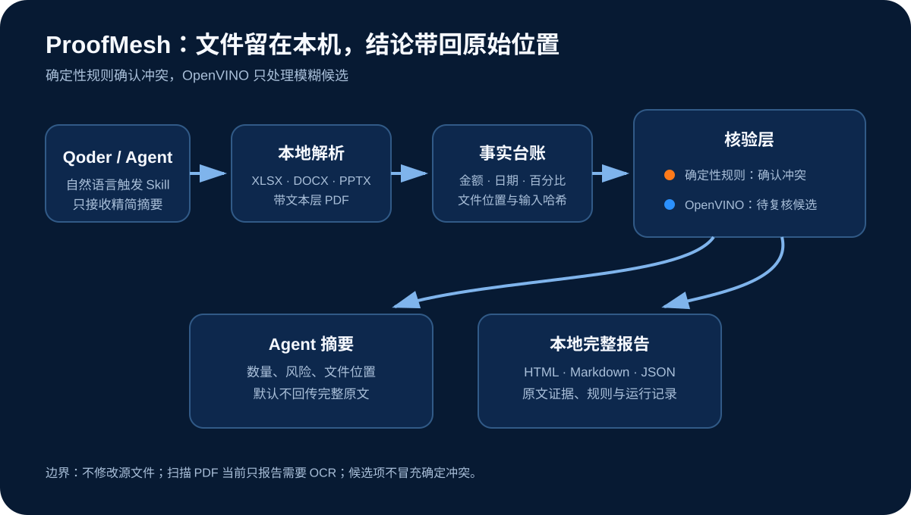

# ProofMesh 文档一致性检查


交付文件多起来以后，散落在表格、方案和汇报稿里的数字很容易失去同步。一份预算表写 1260 万元，另一份汇报材料少了一个零。单看每个文件都像是对的，放在一起才会暴露冲突。

ProofMesh 会读取项目文件夹，在本机整理可比较的事实，并把冲突连回原始位置。当前版本支持 XLSX、DOCX、PPTX 和带文本层的 PDF。RapidFuzz 负责召回近似指标，本机 OpenVINO 中文嵌入模型负责打分；这类结果只进入待确认清单，不会冒充已经确认的冲突。

源码与发布包见 [GitHub 仓库](https://github.com/zhouzhang499-gif/proofmesh-document-auditor) 和 [v0.1.0 Release](https://github.com/zhouzhang499-gif/proofmesh-document-auditor/releases/tag/v0.1.0)。

## 目前能做什么

- 读取一个目录里的 XLSX、DOCX、PPTX 和数字 PDF，不修改源文件。
- 识别金额、百分比、日期和同比、环比口径。
- 按工作表和单元格保存证据位置。
- 找出同一指标在不同文件中的数值冲突。
- 给近似指标生成带字面分数和本地语义分数的复核候选。
- 生成 JSON、Markdown 和本地 HTML 报告。
- 把给 Agent 的简短摘要与本地完整证据分开保存。

报告不会只写“发现异常”。它会直接说明哪两处对不上：

> “项目预算”在两份材料中对不上。预算.xlsx 的 预算表!B2 写的是 1260万元；管理层汇报数据.xlsx 的 汇报数据!B2 写的是 126万元。请确认哪一处是最终值。

## 安装

Windows PowerShell：

```powershell
scripts\install.ps1
```

安装脚本会创建项目自己的 Python 3.11 虚拟环境，不改动系统 Python。ModelScope 轻量包不包含大型模型权重；首次安装会从项目的 GitHub Release 下载 OpenVINO FP16 模型，核对归档和模型文件的 SHA256 后写入本地缓存。模型准备完成后，文档审计可以断网运行。

如果只想安装代码、暂不下载模型：

```powershell
scripts\install.ps1 -SkipModel
```

## 运行

Windows PowerShell：

```powershell
scripts\run.ps1 audit -Path examples\demo_bundle
```

查看服务状态：

```powershell
scripts\run.ps1 status
```

查看某次运行：

```powershell
scripts\run.ps1 show -RunId <run_id>
```

首次体验可先生成原创演示文件：

```powershell
python scripts\create_demo_bundle.py
scripts\run.ps1 audit -Path examples\demo_bundle
```

运行结果保存在 `%LOCALAPPDATA%\ProofMesh\runs`。测试时可以用 `PROOFMESH_HOME` 指向临时目录。

一次运行会保存 `issues.json`、`review_candidates.json`、`file_results.json`、`matching_info.json`、Markdown/HTML 报告和输入文件前后哈希。模型版本、CPU 设备、匹配阈值、规则哈希和清单哈希都有单独记录。

文件损坏、PDF 没有文本层、Excel 公式缺少缓存结果或模型校验失败时，运行状态会变成 `partial`，报告会直接列出没有完成的检查。它不会把“没有读到内容”写成“没有发现冲突”。

## 处理链路



Qoder 或其他 Agent 负责识别用户意图，ProofMesh 在本机读取文件、建立事实台账并运行核验。确定性规则生成确认问题；RapidFuzz 与 OpenVINO 只把相似指标送进待确认清单。Agent 默认只收到精简摘要，完整证据留在本地报告中。

## 报告为什么这样写

审计报告需要让人快速确认事实，不适合堆满口号、抽象判断和整齐排比。ProofMesh 使用 [config/writing_style.yaml](config/writing_style.yaml) 约束 README、Agent 摘要和报告的表达：

- 具体冲突放在前面，风险和建议动作紧跟其后。
- 保留所有金额、日期、文件名、工作表和单元格。
- 不虚构背景，不替用户决定哪个值正确。
- 少用助手口吻、空洞总结和没有信息量的小标题。
- 技术字段放在附录，正文使用项目人员熟悉的说法。

每次运行还会生成 `style_findings.json`。它是一份确定性的写作检查结果，不会把“没有命中规则”误称为“人类写作证明”。规则来源和取舍记录在 [docs/human-writing-research.md](docs/human-writing-research.md)。

## 项目边界

ProofMesh 是交付前的辅助检查工具。它不修改文件，不重新计算 Excel 公式，也不提供法律、财务或投标合规结论。扫描 PDF 仍处在计划中的增强阶段；带文本层的数字 PDF 已经进入默认链路。

## 测试

```powershell
.\.venv\Scripts\python.exe -m pytest
```

当前共有 25 项自动测试，覆盖输入哈希、冲突位置、失败状态、模型校验、下载包安全、报告证据和写作规则。

100 条事实对评测可以单独运行：

```powershell
.\.venv\Scripts\python.exe scripts\run_evaluation.py
```

评测集包含 40 条明确冲突、40 条明确一致和 20 条困难样例。当前固定数据集上的 Precision、Recall、F1 和定位字段完整率均为 100%。这组数字用于锁定现有规则的回归表现，不代表任意真实文档都能达到相同准确率。详细结果见 [evaluation/results/evaluation.md](evaluation/results/evaluation.md)。

## 发布包

```powershell
scripts\package-modelscope.ps1
scripts\package-model.ps1
```

第一条命令生成小于 5MB 的 ModelScope Skill ZIP，根目录只有一个 `SKILL.md`；第二条生成独立模型归档。两个脚本都会输出文件路径、字节数和 SHA256。

## 参赛方向

本项目面向 ModelScope Production AI Skills 大赛，目标宿主是 Qoder 等生产力 Agent。四种文档格式、OpenVINO 候选重排、本地报告和 100 条事实对评测已经进入可运行版本。扫描 PDF OCR 仍是后续能力；正式 Qoder 截图、录屏和 ModelScope 页面以发布时回读结果为准。
